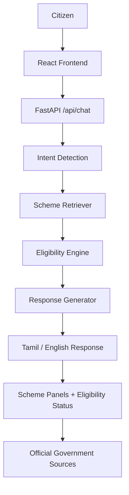

# 🇮🇳 NammaSahay AI

**Tamil-first AI Assistant for Government Welfare Schemes**

> NammaSahay AI helps citizens discover relevant Tamil Nadu government welfare schemes, understand eligibility requirements, view required documents, and access official application sources through a Tamil-first conversational interface.

---

## 📋 Overview

Public welfare schemes are designed to support students, women, farmers, and underprivileged families. However, many eligible citizens miss out on life-changing government support due to:
- **Language Barriers**: Complex technical jargon and English-heavy portals.
- **Fragmented Portals**: Scheme details scattered across multiple departmental websites.
- **Complex Eligibility Rules**: Difficulty understanding age, income, gender, or student criteria.
- **Document Confusion**: Lack of clear guidance on required certificates and application steps.

NammaSahay AI bridges this gap with an accessibility-first, Tamil-first conversational assistant tailored specifically for senior citizens, smartphone beginners, and regional language speakers.

---

## 🎯 Problem Statement

Government welfare information in India is often:
1. **Scattered across departmental portals** (Higher Education, Social Welfare, Health, Skill Development).
2. **Difficult to query naturally** using everyday Tamil phrases.
3. **Hard to evaluate for personal eligibility** without manual rule cross-referencing.
4. **Visually inaccessible** to elderly users due to small fonts, dense layouts, and low-contrast interfaces.

---

## 💡 Solution

NammaSahay AI delivers an integrated pipeline that transforms citizen queries into instant, structured, verified scheme guidance:

```
User Query
    ↓
Intent Detection
    ↓
Scheme Retrieval (Multi-Scheme Discovery)
    ↓
Eligibility Engine (Personalized Criteria Matching)
    ↓
Response Generation (Clean Tamil Summary)
    ↓
Structured Scheme Panels + Verified Government Sources
```

---

## ✨ Key Features

- **🇮🇳 Tamil-first Conversational Interface**: Query schemes in natural Tamil everyday language.
- **🔎 Multi-Scheme Discovery**: Discover multiple relevant welfare programs for broad queries (e.g., student or women welfare).
- **🎯 Personalized Eligibility Checker**: Interactive profile checker matching age, income, student status, and district.
- **📄 Required Document Guidance**: Clear checklist of essential certificates (Aadhaar, Income, Community, Study certificates).
- **📍 Step-by-Step Application Guidance**: Actionable steps on how and where to apply.
- **🌐 Official Government Source Links**: Direct links to verified Tamil Nadu government portals (`.tn.gov.in`).
- **🔤 Accessibility Font Scaling**: Instant `[ A- ] [ A ] [ A+ ]` font scaling with `localStorage` persistence.
- **📱 Full-Screen Responsive Layout**: Adaptable layout optimized for 1920px desktop displays down to 375px mobile screens.
- **🧑‍🦳 Elderly-Friendly UI**: High-contrast light theme, 18px+ base font size, min 44px touch targets, and zero clutter.
- **🌐 Bilingual Support**: Seamless Tamil and English language toggle.

---

## 🏗️ System Architecture



---

## 📁 Project Structure

```
NammaSahay-AI/
├── backend/
│   ├── app/
│   │   ├── api/             # FastAPI chat endpoints & routers
│   │   ├── data/            # Verified Tamil Nadu scheme database
│   │   ├── schemas/         # Pydantic data contracts & request/response models
│   │   └── services/        # Intent detection, retriever, eligibility engine, response generator
│   ├── tests/               # Pytest test suite (32 unit tests)
│   ├── main.py              # FastAPI application entry point
│   └── requirements.txt     # Python backend dependencies
├── frontend/
│   ├── src/
│   │   ├── components/      # Accessible React UI components (Header, ChatWindow, SchemeCards, Modal)
│   │   ├── services/        # API client integration (api.ts)
│   │   ├── types/           # TypeScript interfaces & API contracts
│   │   ├── App.tsx          # Main application & font scale state
│   │   ├── index.css        # Full-screen light theme & accessibility design system
│   │   └── main.tsx         # React entry point
│   ├── package.json         # React + Vite dependencies
│   └── vite.config.ts       # Vite build configuration
├── docs/                    # Project documentation
├── README.md                # Hackathon-ready repository documentation
└── .gitignore               # Version control exclusion configuration
```

---

## 🚀 Getting Started

### Prerequisites
- Python 3.10+
- Node.js 18+ and `npm`

### 1. Backend Setup (FastAPI)
```bash
cd backend
pip install -r requirements.txt
python -m uvicorn main:app --host 127.0.0.1 --port 8001
```
The FastAPI backend will start at `http://127.0.0.1:8001`.
- Health Check: `http://127.0.0.1:8001/health`
- API Endpoint: `POST http://127.0.0.1:8001/api/chat`

### 2. Frontend Setup (React + Vite)
```bash
cd frontend
npm install
npm run dev
```
The React frontend will be available at `http://localhost:5173`.

---

## 🧪 Testing & Verification

### Run Backend Unit Tests (32 Tests)
```bash
cd backend
pytest -q
```
*Result: `32 passed in 1.00s`*

### Run Frontend Production Build
```bash
cd frontend
npm run build
```
*Result: `0 TypeScript errors, 0 build errors`*

---

## 🛡️ License & Disclaimers

NammaSahay AI is developed for civic good and open government scheme discovery. All scheme verification metadata links directly to official Tamil Nadu government source portals (`.tn.gov.in`).
